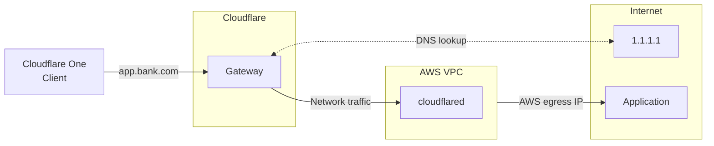

import { Render, Details, GlossaryTooltip } from "~/components";

<Render file="gateway/egress-selector-warp-version" product="cloudflare-one" />

Some third-party services only accept connections from specific source IPs listed in an Access Control List (ACL). If a non-Cloudflare IP (for example, an IP from your ISP or a cloud provider like AWS) is already on their allowlist, you can route traffic through a Cloudflare Tunnel so that it exits using that same IP. This is called source IP anchoring — it allows you to keep your existing egress IPs without purchasing [Cloudflare dedicated egress IPs](/cloudflare-one/traffic-policies/egress-policies/dedicated-egress-ips/).

For example, assume your banking service at `app.bank.com` expects traffic from an AWS IP. You install `cloudflared` in your AWS environment and add a public hostname route for `app.bank.com`. When users connect to `app.bank.com` through the Cloudflare One Client, Gateway applies your network policies and routes the filtered traffic through the Cloudflare Tunnel to AWS. The traffic then exits to the public Internet using your AWS egress IP.

To learn more about how Gateway applies hostname-based egress policies, refer to the [Cloudflare blog](https://blog.cloudflare.com/egress-policies-by-hostname/).

## Prerequisites

User traffic must be on-ramped to Gateway using one of the following methods:

<Render file="gateway/egress-selector-onramps" product="cloudflare-one" />

## 1. Connect your private network

[Connect your private network](/cloudflare-one/networks/connectors/cloudflare-tunnel/private-net/cloudflared/connect-cidr/) to Cloudflare using `cloudflared`. For example, if you want traffic to egress from AWS, connect the private CIDR block of your AWS VPC.

::::note
Requires `cloudflared` version 2025.7.0 or later.
::::

## 2. Add a public hostname route

To route a public hostname through Cloudflare Tunnel:

1. In [Cloudflare One](https://one.dash.cloudflare.com), go to **Networks** > **Routes** > **Hostname routes**.

2. Select **Create hostname route**.

3. In **Hostname**, enter the public hostname that represents the application (for example, `app.bank.com`). The hostname should be accessible from the public Internet.

4. For **Tunnel**, select the Cloudflare Tunnel that is being used to connect the private network to Cloudflare.

5. Select **Create route**.

## 3. Route network traffic through the Cloudflare One Client

In your WARP [Split Tunnels](/cloudflare-one/team-and-resources/devices/cloudflare-one-client/configure/route-traffic/split-tunnels/) configuration, route the following IP addresses through the WARP tunnel to Gateway.

### Initial resolved IPs

When users connect to a public hostname route, Gateway will assign an <GlossaryTooltip term="initial resolved IP">initial resolved IP</GlossaryTooltip> to the DNS query from the following range:

Gateway's network engine operates at Layer 3/Layer 4 of the [OSI model](https://www.cloudflare.com/learning/ddos/glossary/open-systems-interconnection-model-osi/), where only IP addresses are available — not hostnames. The initial resolved IP acts as a signal: when a packet's destination IP falls within the `100.80.0.0/16` Carrier-Grade NAT (CGNAT) range, Gateway recognizes that the IP maps to a public hostname route and sends the traffic through the corresponding Cloudflare Tunnel.

To route initial resolved IPs through the Cloudflare One Client:

<Render file="gateway/egress-selector-split-tunnels" product="cloudflare-one" />

### Private network IPs

Your private network's CIDR block should also route through the WARP tunnel. For a detailed configuration example, refer to [Connect a private network](/cloudflare-one/networks/connectors/cloudflare-tunnel/private-net/cloudflared/connect-cidr/#3-route-private-network-ips-through-the-cloudflare-one-client).

## 4. (Optional) Configure network policies

You can build [Gateway network policies](/cloudflare-one/traffic-policies/network-policies/) to filter HTTPS traffic to your public hostname on port `443`. For example, to restrict `app.bank.com` so that only certain users or groups can access it through your AWS egress IP, create two policies: one to allow authorized users, and one to block everyone else.

1. Allow company employees:

   <Render
   	file="gateway/policies/restrict-access-to-private-networks-allow"
   	product="cloudflare-one"
   	params={{ selector: "SNI", value: "app.bank.com" }}
   />

2. Block everyone else on port `443`:

   | Selector | Operator | Value          | Action |
   | -------- | -------- | -------------- | ------ |
   | SNI      | in       | `app.bank.com` | Block  |

Gateway does not support hostname-based filtering for traffic on non-`443` ports. To block traffic to `app.bank.com` on all ports, use the [Destination IP](/cloudflare-one/traffic-policies/network-policies/#destination-ip) selector and specify the public IP range of `app.bank.com`.

## 5. Test the connection

From a device, open a browser and go to `app.bank.com`.

You can search for `app.bank.com` in your [Gateway DNS logs](/cloudflare-one/insights/logs/dashboard-logs/gateway-logs/); the **DNS response details** section should show the public resolved IPs as well as an <GlossaryTooltip term="initial resolved IP">initial resolved IP</GlossaryTooltip>. You can also check your [Cloudflare Tunnel logs](/cloudflare-one/networks/connectors/cloudflare-tunnel/monitor-tunnels/logs/) to confirm that requests are routing through the tunnel to the public resolved IPs.

## Limitations

### Google Chrome restricts local network access

<Render file="gateway/egress-selector-chrome-issue" product="cloudflare-one" />
